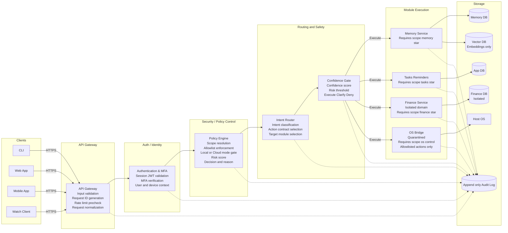

```mermaid
flowchart LR

  subgraph Clients
    CLI[CLI]
    WEB[Web App]
    MOB[Mobile App]
    WAT[Watch Client]
  end

  subgraph APIGW["API Gateway"]
    GW["API Gateway<br/>Input validation<br/>Request ID generation<br/>Rate limit precheck<br/>Request normalization"]
  end

  subgraph AUTHLANE["Auth / Identity"]
    AUTH["Authentication & MFA<br/>Session JWT validation<br/>MFA verification<br/>User and device context"]
  end

  subgraph POLICYLANE["Security / Policy Control"]
    POL["Policy Engine<br/>Scope resolution<br/>Allowlist enforcement<br/>Local or Cloud mode gate<br/>Risk score<br/>Decision and reason"]
  end

  subgraph ROUTE["Routing and Safety"]
    IR["Intent Router<br/>Intent classification<br/>Action contract selection<br/>Target module selection"]
    CG["Confidence Gate<br/>Confidence score<br/>Risk threshold<br/>Execute Clarify Deny"]
  end

  subgraph MODULES["Module Execution"]
    MEM["Memory Service<br/>Requires scope memory star"]
    TASKS["Tasks Reminders<br/>Requires scope tasks star"]
    FIN["Finance Service<br/>Isolated domain<br/>Requires scope finance star"]
    OSB["OS Bridge<br/>Quarantined<br/>Requires scope os control<br/>Allowlisted actions only"]
  end

  subgraph STORAGE["Storage"]
    APPDB[(App DB)]
    MEMDB[(Memory DB)]
    VECDB[(Vector DB<br/>Embeddings only)]
    FINDB[(Finance DB<br/>Isolated)]
    HOST[Host OS]
    AUD[(Append only Audit Log)]
  end

  CLI -->|HTTPS| GW
  WEB -->|HTTPS| GW
  MOB -->|HTTPS| GW
  WAT -->|HTTPS| GW

  GW --> AUTH --> POL --> IR --> CG

  CG -->|Execute| MEM
  CG -->|Execute| TASKS
  CG -->|Execute| FIN
  CG -->|Execute| OSB

  MEM --> MEMDB
  MEM --> VECDB
  TASKS --> APPDB
  FIN --> FINDB
  OSB --> HOST

  GW -.-> AUD
  AUTH -.-> AUD
  POL -.-> AUD
  IR -.-> AUD
  CG -.-> AUD
  MEM -.-> AUD
  TASKS -.-> AUD
  FIN -.-> AUD
  OSB -.-> AUD
```
